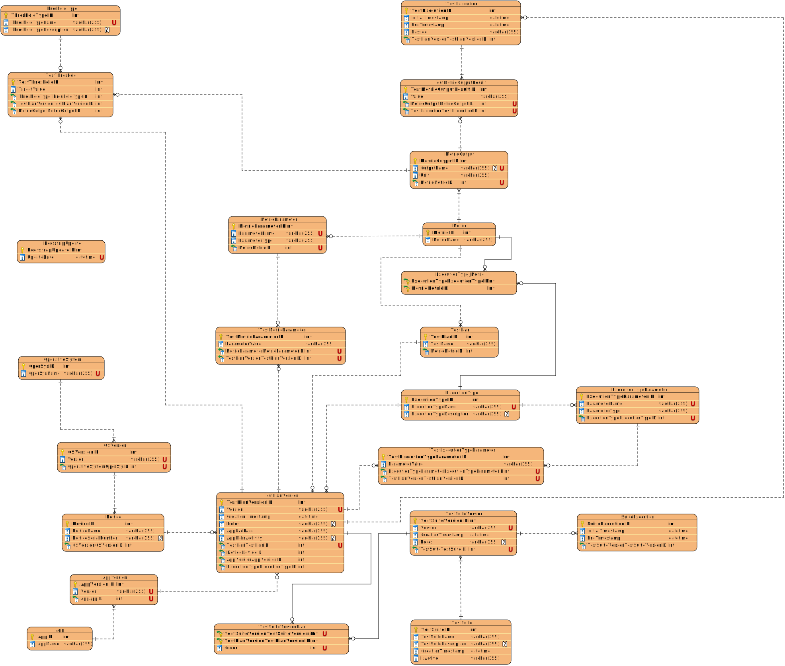

# **Database Schema Documentation**

This document provides a comprehensive explanation of the database schema for the system. It covers the structure of each table, columns, foreign key constraints, unique constraints, triggers, and the flow of data across tables, ensuring a complete understanding of the system.

---

## **1. Overview**

The database is used to track and manage applications, devices, test executions, performance metrics, and related parameters. This system helps manage performance testing data for different devices and application versions. Each test execution records various metrics and their outputs, as well as linking devices, operating systems, and application versions.

### **Database ER Diagram**

---

## **2. Data Flow Overview**

The flow of data in the system can be described as follows:

1. **Application Setup**:
   - An `App` (Application) is created in the system, and each `App` has one or more versions (`AppVersion`).
  
2. **Device and OS Management**:
   - Devices are registered in the system with their corresponding `OSVersion` and `OperativeSystem`. These devices are used in test executions to track performance across different environments.

3. **Test Execution**:
   - A `TestSuite` (a collection of test cases) is created, and each test within the suite is executed under the `TestExecution` table. The execution includes details like which `AppVersion`, `Device`, and `ExecutionType` were used, as well as the start and end times.
  
4. **Metrics Collection**:
   - During each test execution, performance `Metrics` are measured. These metrics are stored in the `TestMetric` table, along with their corresponding outputs, which are linked to the `MetricOutput` table.

5. **Execution Type and Parameters**:
   - The system supports different `ExecutionType` configurations (e.g., "Cold Start" or "Warm Start"). Each execution type can have parameters, which are stored in the `ExecutionTypeParameter` table and linked to the corresponding test executions.

6. **Thresholds and Results**:
   - The system supports thresholds for performance metrics, which are defined in the `TestMetricThreshold` table. These thresholds specify acceptable ranges for metrics like response times. If a metric value falls outside the specified range, it triggers an alert or marks the result as a failure.

---

## **3. Tables and Their Descriptions**

### **Device Table**
- **Purpose**: Stores information about devices used in performance test executions.
- **Columns**:
  - `DeviceID`: Unique identifier for each device (Primary Key).
  - `DeviceName`: The name of the device (e.g., "iPhone 12").
  - `DeviceSerialNumber`: A unique serial number for the device, ensuring no duplicates.
  - `OSVersionOSVersionID`: Foreign key linking to the `OSVersion` table.

### **OperativeSystem Table**
- **Purpose**: Stores information about operating systems.
- **Columns**:
  - `OperSysID`: Unique identifier for each operating system (Primary Key).
  - `OperSysName`: The name of the operating system (e.g., "iOS").

### **OSVersion Table**
- **Purpose**: Stores information about specific versions of operating systems used by devices.
- **Columns**:
  - `OSVersionID`: Unique identifier for each OS version (Primary Key).
  - `Version`: The version of the operating system (e.g., "14.4").
  - `OperativeSystemOperSysID`: Foreign key referencing `OperativeSystem`.

### **App Table**
- **Purpose**: Stores information about applications being tested.
- **Columns**:
  - `AppID`: Unique identifier for each application (Primary Key).
  - `AppName`: The name of the application (e.g., "MyApp").

### **AppVersion Table**
- **Purpose**: Stores details about different versions of each application.
- **Columns**:
  - `AppVersionID`: Unique identifier for each app version (Primary Key).
  - `Version`: The version of the application (e.g., "1.0.0").
  - `AppAppID`: Foreign key linking to the `App` table.

### **Metric Table**
- **Purpose**: Stores information about the performance metrics being tracked during test executions.
- **Columns**:
  - `MetricID`: Unique identifier for each metric (Primary Key).
  - `MetricName`: Name of the metric (e.g., "Startup Time").

### **TestExecution Table**
- **Purpose**: Stores information about each individual test execution.
- **Columns**:
  - `TestExecutionID`: Unique identifier for each test execution (Primary Key).
  - `TestExecutionDescription`: A description of the test execution.
  - `InitialTimestamp`: The timestamp when the test starts.
  - `EndTimestamp`: The timestamp when the test ends.
  - `AppVersionAppVersionID`: Foreign key linking to `AppVersion`.
  - `DeviceDeviceID`: Foreign key linking to `Device`.
  - `TestSuiteTestSuiteID`: Foreign key linking to `TestSuite`.
  - `ExecutionTypeExecutionTypeID`: Foreign key linking to `ExecutionType`.
  - `MetricMetricID`: Foreign key linking to `Metric`.

### **TestMetric Table**
- **Purpose**: Stores the results of metrics for each test execution.
- **Columns**:
  - `TestMetricID`: Unique identifier for each test metric (Primary Key).
  - `Value`: The value of the metric (e.g., "5 seconds").
  - `MetricOutputMetricOutputID`: Foreign key linking to `MetricOutput`.
  - `TestExecutionTestExecutionID`: Foreign key linking to `TestExecution`.

### **TestSuite Table**
- **Purpose**: Stores information about the test suites, which are collections of test cases.
- **Columns**:
  - `TestSuiteID`: Unique identifier for each test suite (Primary Key).
  - `TestSuiteName`: The name of the test suite.
  - `TestSuiteDescription`: A description of the test suite.
  - `InitialTimestamp`: The start time of the test suite.
  - `EndTimestamp`: The end time of the test suite.

### **ExecutionType Table**
- **Purpose**: Stores information about execution types (e.g., Cold Start, Warm Start).
- **Columns**:
  - `ExecutionTypeID`: Unique identifier for each execution type (Primary Key).
  - `ExecutionTypeName`: The name of the execution type.
  - `ExecutionTypeDescription`: A description of the execution type.

### **MetricOutput Table**
- **Purpose**: Stores outputs for each metric (e.g., response time, performance time).
- **Columns**:
  - `MetricOutputID`: Unique identifier for each metric output (Primary Key).
  - `OutputName`: The name of the metric output.
  - `Unit`: The unit of the output (e.g., "seconds").
  - `MetricMetricID`: Foreign key linking to `Metric`.

### **ThresholdType Table**
- **Purpose**: Stores types of thresholds for each metric.
- **Columns**:
  - `ThresholdTypeID`: Unique identifier for each threshold type (Primary Key).
  - `ThresholdTypeName`: Name of the threshold type.
  - `ThresholdTypeDescription`: Description of the threshold type.

### **TestMetricThreshold Table**
- **Purpose**: Stores threshold values for each test metric.
- **Columns**:
  - `TestMetricThresholdID`: Unique identifier for each threshold (Primary Key).
  - `MinValue`: The minimum acceptable value for the metric.
  - `MaxValue`: The maximum acceptable value for the metric.
  - `TargetValue`: The target value for the metric.
  - `Tolerance`: The tolerance allowed for the metric.
  - `Severity`: The severity level of the threshold.
  - `TestMetricTestMetricID`: Foreign key linking to `TestMetric`.
  - `ThresholdTypeThresholdTypeID`: Foreign key linking to `ThresholdType`.

### **TestExecutionTypeParameter Table**
- **Purpose**: Stores parameters for each execution type linked to a test execution.
- **Columns**:
  - `TestExecutionTypeParameterID`: Unique identifier for each parameter (Primary Key).
  - `ParameterValue`: The value of the execution type parameter.
  - `TestExecutionTestExecutionID`: Foreign key linking to `TestExecution`.
  - `ExecutionTypeParameterExecutionTypeParameterID`: Foreign key linking to `ExecutionTypeParameter`.

### **ExecutionType_Metric Table**
- **Purpose**: Stores relationships between execution types and metrics.
- **Columns**:
  - `ExecutionTypeExecutionTypeID`: Foreign key linking to `ExecutionType`.
  - `MetricMetricID`: Foreign key linking to `Metric`.

### **ExecutionTypeParameter Table**
- **Purpose**: Stores parameters for each execution type.
- **Columns**:
  - `ExecutionTypeParameterID`: Unique identifier for each parameter (Primary Key).
  - `ParameterName`: The name of the parameter.
  - `ParameterType`: The type of the parameter.
  - `ExecutionTypeExecutionTypeID`: Foreign key linking to `ExecutionType`.

### **MetricParameter Table**
- **Purpose**: Stores parameters for each metric.
- **Columns**:
  - `MetricParameterID`: Unique identifier for each parameter (Primary Key).
  - `ParameterName`: The name of the parameter.
  - `ParameterType`: The type of the parameter.
  - `MetricMetricID`: Foreign key linking to `Metric`.

### **TestMetricParameter Table**
- **Purpose**: Stores parameters for each test metric.
- **Columns**:
  - `TestMetricParameterID`: Unique identifier for each test metric parameter (Primary Key).
  - `ParameterValue`: The value of the metric parameter.
  - `TestExecutionTestExecutionID`: Foreign key linking to `TestExecution`.
  - `MetricParameterMetricParameterID`: Foreign key linking to `MetricParameter`.

---

## **4. Constraints**

### **Unique Constraints**
- **UQ_VERSION_PER_OS**: Ensures that each version of an operating system is unique for each `OperativeSystem`.
- **UQ_OUTPUT_PER_METRIC**: Ensures that each metric output is unique for each `Metric`.
- **UQ_PARAMETER_PER_METRIC**: Ensures that each parameter is unique for each `Metric`.
- **UN_VERSION_PER_APP**: Ensures that each version is unique for each `App`.
- **UQ_PARAMETER_PER_EXECUTION_TYPE**: Ensures that each execution type parameter is unique for each execution type.
- **UQ_METRIC_PARAMETER_PER_TEST**: Ensures that each test metric parameter is unique for each test execution.
---

## **5. Triggers**

### **ENSURE_METRICCONSISTENCY**
- **Purpose**: Ensures that the `MetricID` in `TestExecution` matches the `MetricID` in `MetricOutput` before inserting or updating a `TestMetric`.
- **Logic**: 
  - The trigger queries the `TestExecution` table to get the `MetricID` and compares it with the `MetricID` from the `MetricOutput` linked to the `TestMetric` record. 
  - If they do not match, an error is raised to prevent inconsistent data in the system.

### **Ensure_ExecutionTypeParameter_Consistency**
- **Purpose**: Ensures that the `ExecutionTypeID` in `TestExecution` matches the `ExecutionTypeID` in the `ExecutionTypeParameter` before inserting or updating.
- **Logic**:
  - The trigger first queries the `TestExecution` table to retrieve the `ExecutionTypeID`. Then, it queries the `ExecutionTypeParameter` table to ensure that the `ExecutionTypeID` for the given `TestExecution` matches the one in the `ExecutionTypeParameter`.
  - If the IDs do not match, an error is raised to ensure that parameters are properly linked to the correct execution type.

---