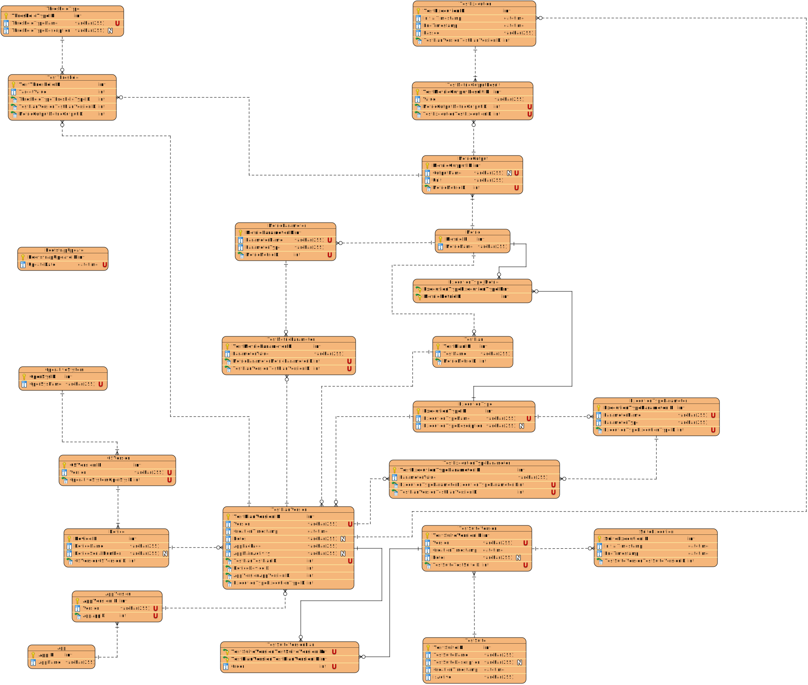

# **Database Schema Documentation**

This document provides a comprehensive explanation of the database schema for the system. It covers the structure of each table, columns, foreign key constraints, unique constraints, and the flow of data across tables, ensuring a complete understanding of the system.

---

## **1. Overview**

The database is used to track and manage applications, devices, test executions, performance metrics, and related parameters. This system helps manage performance testing data for different devices and application versions. Each test execution records various metrics and their outputs, as well as linking devices, operating systems, and application versions.

### **Database ER Diagram**

---

## **2. Data Flow Overview**

The flow of data in the system can be described as follows:

1. **Database Bootsrap**

   - The system initializes with a set of predefined `ThresholdType`entries, which define the types of thresholds that can be applied to performance metrics (e.g., "Maximum", "Minimum", "Average"). It also includes predefined 'Metric' entries and it's corresponding parameter, output and configuration entries, which define the performance metrics to be tracked (e.g., "Startup Time", "Memory Usage"). These entries are essential for the system to function correctly and provide a baseline for performance testing.
   - The information is checked regularly to ensure that the system has the necessary metrics and thresholds defined for performance testing. If any required entries are missing, they are created automatically to maintain the integrity of the system. This check is made initially by checking `BoostrapUpdate`, which stores the last update timestamp of the bootstrap process. If the timestamp is older than the timestamp stored in the .json file, the system will automatically create the necessary entries in the database.

2. **Application Setup**

   - An `App` (Application) is created in the system, and each `App` has one or more versions (`AppVersion`).

3. **Device and OS Management**

   - Devices are registered in the system with their corresponding `OSVersion` and `OperativeSystem`. These devices are used in test executions to track performance across different environments.

4. **Test Planning and Execution**

   - A `TestPlan` represents a single performance test configuration. Each plan is versioned via `TestPlanVersion`.
   - Multiple plans can be grouped into a `TestSuite`, and each suite has one or more versions (`TestSuiteVersion`).
   - A `TestExecution` corresponds to the execution of a specific `TestPlanVersion`, while a `SuiteExecution` corresponds to the execution of a full `TestSuiteVersion`.

5. **Metric Configuration**

   - Each `Metric` defines a measurable aspect of performance (e.g., "Startup Time").
   - Metrics can have multiple outputs (`MetricOutput`) and may require parameters (`MetricParameter`).
   - Parameter values used in each test execution are stored in `TestMetricParameter`.
   - The valid combinations of `ExecutionType` and `Metric` are tracked in `ExecutionType_Metric`.

6. **Execution Type and Parameters**

   - The system supports multiple `ExecutionType` configurations (e.g., "Cold Start", "Warm Start").
   - Each `ExecutionType` can define its own parameters via `ExecutionTypeParameter`.
   - These are instantiated per execution in `TestExecutionTypeParameter`.

7. **Metrics Collection and Evaluation**
   - During each `TestExecution`, output values are recorded in `TestMetricOutputResult`, linked to specific `MetricOutput` entries.
   - Performance thresholds (`TestThreshold`) are applied to evaluate the results, using definitions from `ThresholdType`.

---

## **3. Tables and Their Descriptions**

### **Device Table**
- **Purpose**: Stores information about devices used in performance test executions.
- **Columns:**
  - **PK** `DeviceID`
  - `DeviceName`
  - `DeviceSerialNumber`
  - **FK** `OSVersionOSVersionID`

### **OperativeSystem Table**
- **Purpose**: Stores information about operating systems.
- **Columns:**
  - **PK** `OperSysID`
  - `OperSysName`

### **OSVersion Table**
- **Purpose**: Stores information about specific versions of operating systems used by devices.
- **Columns:**
  - **PK** `OSVersionID`
  - `Version`
  - **FK** `OperativeSystemOperSysID`

### **App Table**
- **Purpose**: Stores information about applications being tested.
- **Columns:**
  - **PK** `AppID`
  - `AppName`

### **AppVersion Table**
- **Purpose**: Stores details about different versions of each application.
- **Columns:**
  - **PK** `AppVersionID`
  - `Version`
  - **FK** `AppAppID`

### **Metric Table**
- **Purpose**: Stores information about the performance metrics being tracked during test executions.
- **Columns:**
  - **PK** `MetricID`
  - `MetricName`

### **TestExecution Table**
- **Purpose**: Stores information about each individual test execution.
- **Columns:**
  - **PK** `TestExecutionID`
  - `InitialTimestamp`
  - `EndTimestamp`
  - `Passed`
  - **FK** `TestPlanVersionTestPlanVersionID`

### **TestMetricOutputResult Table**
- **Purpose**: Stores the results of metric outputs for each test execution.
- **Columns:**
  - **PK** `TestMetricOutputResultID`
  - `Value`
  - **FK** `MetricOutputMetricOutputID`
  - **FK** `TestExecutionTestExecutionID`

### **TestSuite Table**
- **Purpose**: Stores information about the test suites, which are collections of test cases.
- **Columns:**
  - **PK** `TestSuiteID`
  - `TestSuiteName`
  - `TestSuiteDescription`
  - `CreationTimestamp`
  - `isActive`

### **ExecutionType Table**
- **Purpose**: Stores information about execution types (e.g., Cold Start, Warm Start).
- **Columns:**
  - **PK** `ExecutionTypeID`
  - `ExecutionTypeName`
  - `ExecutionTypeDescription`

### **MetricOutput Table**
- **Purpose**: Stores outputs for each metric (e.g., response time, performance time).
- **Columns:**
  - **PK** `MetricOutputID`
  - `OutputName`
  - `Unit`
  - **FK** `MetricMetricID`

### **ThresholdType Table**
- **Purpose**: Stores types of thresholds for each metric.
- **Columns:**
  - **PK** `ThresholdTypeID`
  - `ThresholdTypeName`
  - `ThresholdTypeDescription`

### **TestThreshold Table**
- **Purpose**: Stores threshold values for each metric output result.
- **Columns:**
  - **PK** `TestThresholdID`
  - `TargetValue`
  - **FK** `ThresholdTypeThresholdTypeID`
  - **FK** `TestPlanVersionTestPlanVersionID`
  - **FK** `MetricOutputMetricOutputID`

### **TestExecutionTypeParameter Table**
- **Purpose**: Stores parameters for each execution type linked to a test execution.
- **Columns:**
  - **PK** `TestExecutionTypeParameterID`
  - `ParameterValue`
  - **FK** `ExecutionTypeParameterExecutionTypeParameterID`
  - **FK** `TestPlanVersionTestPlanVersionID`

### **ExecutionType_Metric Table**
- **Purpose**: Stores relationships between execution types and metrics.
- **Columns:**
  - **PK, FK** `ExecutionTypeExecutionTypeID`
  - **PK, FK** `MetricMetricID`

### **ExecutionTypeParameter Table**
- **Purpose**: Stores parameters for each execution type.
- **Columns:**
  - **PK** `ExecutionTypeParameterID`
  - `ParameterName`
  - `ParameterType`
  - **FK** `ExecutionTypeExecutionTypeID`

### **MetricParameter Table**
- **Purpose**: Stores parameters for each metric.
- **Columns:**
  - **PK** `MetricParameterID`
  - `ParameterName`
  - `ParameterType`
  - **FK** `MetricMetricID`

### **TestMetricParameter Table**
- **Purpose**: Stores parameters for each test metric.
- **Columns:**
  - **PK** `TestMetricParameterID`
  - `ParameterValue`
  - **FK** `MetricParameterMetricParameterID`
  - **FK** `TestPlanVersionTestPlanVersionID`

### **SuiteExecution Table**
- **Purpose**: Represents the execution of a test suite.
- **Columns:**
  - **PK** `SuiteExecutionID`
  - `InitialTimestamp`
  - `EndTimestamp`
  - **FK** `TestSuiteVersionTestSuiteVersionID`

### **TestSuiteVersion Table**
- **Purpose**: Stores version information of test suites.
- **Columns:**
  - **PK** `TestSuiteVersionID`
  - `Version`
  - `CreationTimestamp`
  - `Notes`
  - **FK** `TestSuiteTestSuiteID`

### **TestPlan Table**
- **Purpose**: Represents a planned set of tests.
- **Columns:**
  - **PK** `TestPlanID`
  - `TestName`
  - **FK** `MetricMetricID`

### **TestPlanVersion Table**
- **Purpose**: Versioning of test plans.
- **Columns:**
  - **PK** `TestPlanVersionID`
  - `Version`
  - `CreationTimestamp`
  - `Notes`
  - `AppPackage`
  - `AppMainActivity`
  - **FK** `TestPlanTestPlanID`
  - **FK** `DeviceDeviceID`
  - **FK** `AppVersionAppVersionID`
  - **FK** `ExecutionTypeExecutionTypeID`

### **TestSuiteVersionPlan Table**
- **Purpose**: Mapping between test suite versions and plan versions.
- **Columns:**
  - **PK, FK** `TestSuiteVersionTestSuiteVersionID`
  - **PK, FK** `TestPlanVersionTestPlanVersionID`
  - `Order`

### **BootstrapUpdate Table**
- **Purpose**: Tracks the last update timestamp of the bootstrap process.
- **Columns:**
  - **PK** `BootstrapUpdateID`
  - `UpdateDate`

---

## **4. Relationships Between Tables**

**A `TestPlan` can have multiple `TestPlanVersions`**  
This allows versioning of a test definition without losing history. Whenever there are changes to parameters, applications, devices, or execution type, a new version is created to ensure traceability and reproducibility.

**A `TestSuite` can have multiple `TestSuiteVersions`**  
Just like individual tests, test suites are also versioned. This allows the evolution of test compositions without affecting previous executions.

**A `TestSuiteVersion` aggregates multiple `TestPlanVersions` through `TestSuiteVersionPlan`**  
This relationship defines which test versions belong to each suite version, including the execution order.

**A `TestExecution` is always associated with a `TestPlanVersion`**  
Each execution records exactly which test plan version was used, ensuring traceability and consistency of results.

**A `SuiteExecution` is always associated with a `TestSuiteVersion`**  
When a suite is executed, a `SuiteExecution` is created that points to the exact version of the suite executed.

**Each `TestExecution` can generate multiple `TestMetricOutputResult`**  
These results represent the measured outputs during the test execution, linked to the defined metrics.

**Each `TestMetricOutputResult` is associated with a `MetricOutput`**  
Defines the type of value measured (e.g., startup time, CPU usage).

**Each `MetricOutput` belongs to a single `Metric`**  
Different types of results can be defined for the same metric (for example, total time vs. time to first frame).

**A `TestThreshold` is associated with a `MetricOutput` and a `TestPlanVersion`**  
Allows setting acceptable limits for each metric output, tailored to the plan version.

**An `ExecutionTypeParameter` belongs to an `ExecutionType`**  
Defines the parameters required to execute tests of a certain type (e.g., element to wait for in a Cold Start).

**Each `TestExecutionTypeParameter` instantiates an `ExecutionTypeParameter` with a value, for a `TestPlanVersion`**  
Allows storing the actual values used in each execution, maintaining the history of parameters passed to the test.

**The same applies to `MetricParameter` and `TestMetricParameter`**  
`MetricParameter` defines what can be parameterized; `TestMetricParameter` stores the actual value used in the execution.
